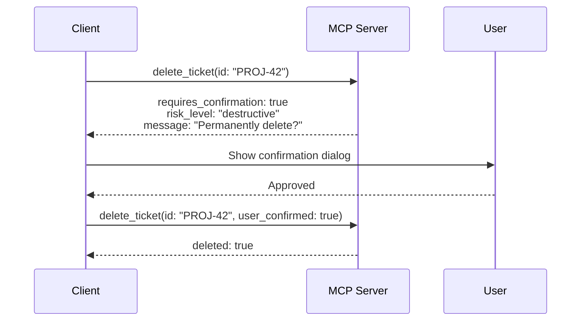
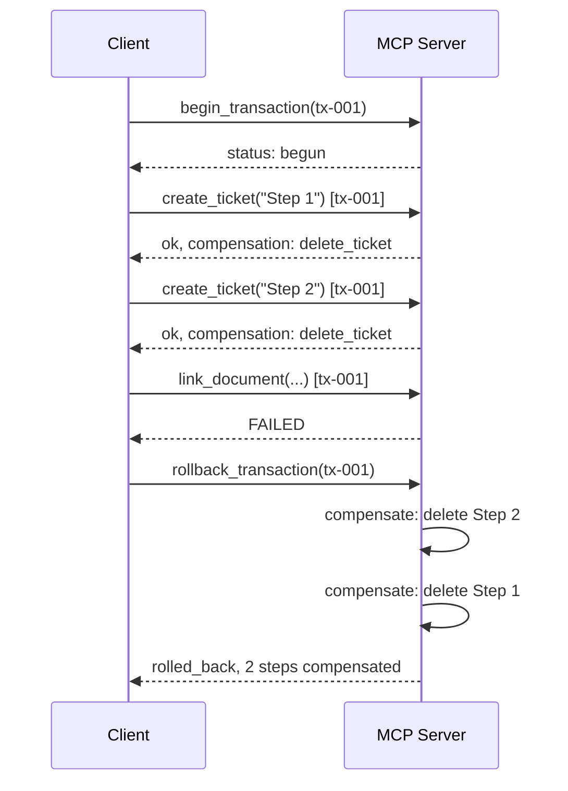
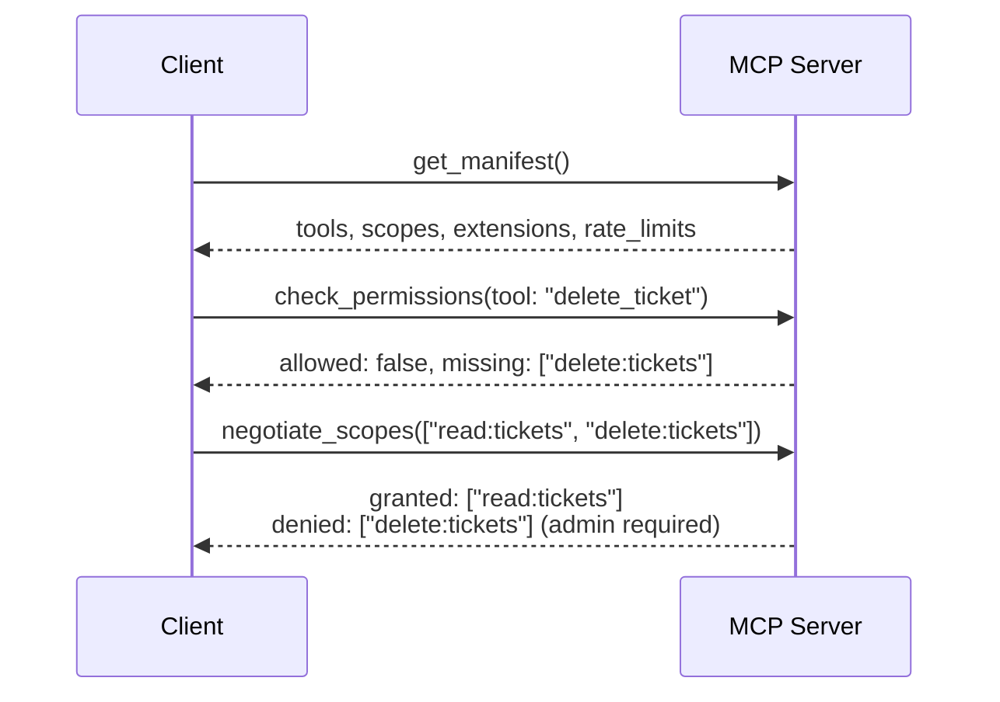

# Proposal: MCP Protocol Extensions for Robust Agent Workflows

> **RFC-style proposal for extending the Model Context Protocol**

## What MCP Gets Right

MCP is one of the most impactful ideas to emerge from the AI ecosystem in recent years. It solved a real problem — the lack of a standardized interface between language models and external tools — and solved it elegantly. The core design decisions are sound:

- **Open and model-agnostic.** Any model, any server, one protocol. This is the right foundation and must remain non-negotiable.
- **Simple request-response semantics.** Easy to implement, easy to reason about, easy to debug.
- **Tool-level granularity.** Servers expose discrete capabilities rather than monolithic APIs. This maps naturally to how agents plan and execute.
- **JSON-RPC transport.** A proven, lightweight wire format with broad ecosystem support.

For single-step tool calls — "search Jira for issue X", "fetch the weather in Berlin" — MCP already works remarkably well. This proposal is about what happens when you move beyond single steps.

> **Baseline:** This proposal is written against the [MCP specification as of 2025-03-26](https://spec.modelcontextprotocol.io/). Some features described here may overlap with newer spec revisions — contributions that track the latest spec are welcome.

## Where MCP Hits Its Limits

In practice, real-world agent workflows are multi-step, data-intensive, and failure-prone. MCP's current design creates systematic friction in five areas. This proposal addresses each with concrete, backwards-compatible extensions.

---

## Pillar I — Transparency and Planning

### 1. Capability Discovery and Service Manifest

**Problem:** Clients today call tools semi-blindly. They learn what a server supports through static descriptions baked into prompts, and discover limitations only when calls fail.

**Proposal:** Every MCP server MUST expose a standardized service manifest at connection time — a machine-readable document containing:

- Available tools with fully typed input/output signatures
- Supported authentication mechanisms and current scopes
- Rate limits and quotas
- Support for streaming, pagination, and batch operations
- Server version and implemented MCP spec version

**Extension — Runtime Introspection:** Because server capabilities can change at runtime (new custom fields in Jira, new workspaces in Asana), servers SHOULD also expose a `/capabilities` endpoint that returns the current schema on demand — not only during the initial handshake.

This is similar in spirit to the Language Server Protocol's capability negotiation and would eliminate an entire class of trial-and-error tool calls.

---

### 2. Intent Hints

**Problem:** Tool calls communicate *what* the client wants to do (which tool, which parameters) but not *why*. The server has no way to suggest a better approach.

**Proposal:** An optional `intent` field on tool invocations that describes the purpose of the call:

```json
{
  "tool": "search_issues",
  "parameters": { "query": "deployment failure" },
  "intent": "Find the most recent ticket related to last Friday's deployment incident"
}
```

The server MAY respond with a routing suggestion:

```json
{
  "suggestion": {
    "recommended_tool": "get_recent_incidents",
    "reason": "Filters by incident type and recency, more efficient for this use case"
  }
}
```

This turns the server from a passive executor into a collaborative participant that can guide clients toward optimal tool usage.

---

### 3. Cost and Latency Transparency

**Problem:** Clients cannot estimate whether a tool call will take milliseconds or minutes, whether it incurs cost, or whether it consumes quota.

**Proposal:** The service manifest SHOULD declare per tool:

- Estimated latency class: `instant`, `seconds`, `minutes`
- Cost category: `free`, `metered`, `requires_approval`
- Quota consumption per call

```json
{
  "tool": "export_analytics",
  "cost": { "category": "metered", "estimated_units": 5 },
  "latency": "minutes",
  "quota": { "remaining": 12, "resets_at": "2026-03-16T00:00:00Z" }
}
```

This enables informed decision-making: "This export will take ~2 minutes and use 5 of your 12 remaining daily API calls. Should I proceed, or would you prefer a smaller date range?"

---

## Pillar II — Safety and Reliability

### 4. Granular Permissions and Scoped Auth

**Problem:** Permissions are binary — a server is connected or it isn't. Clients discover permission boundaries only through 403 errors.

**Proposal:**

- **Fine-grained scopes** declared during the MCP handshake, e.g., `read:github_repoX`, `write:linear_ticket`, `temp:30min`
- A **`/permissions` endpoint** or `can_execute` predicate that allows pre-flight permission checks before attempting a call
- **Session tokens with TTL** that automatically expire after a defined period of inactivity
- **Transparent scope reporting** so the client can inform the user: "I can read your Jira tickets but not edit them — would you like to grant write access?"

This is the prerequisite for users trusting agents with complex multi-step workflows. Without it, every chained operation is a gamble.

---

### 5. Idempotency and Transactions

**Problem:** Multi-step operations have no concept of atomicity. If step 3 of 5 fails, steps 1 and 2 remain in a potentially inconsistent state. Network failures can produce duplicates.

**Proposal:**

**Idempotency keys** as a standard header on state-changing operations. A repeated call with the same key MUST have no additional effect:

```
X-Idempotency-Key: op-2026-03-15-abc123
```

**Optional transaction wrapper** for multi-step operations. Servers that support transactions register compensation actions for each step:

```
BEGIN_TRANSACTION tx-001
  → create_jira_ticket(...)      → OK (compensate: delete_ticket)
  → link_confluence_doc(...)     → OK (compensate: unlink_doc)
  → post_slack_message(...)      → FAIL
ROLLBACK tx-001
  ← unlink_doc()
  ← delete_ticket()
```

The transaction mechanism is opt-in. Servers that don't support it simply reject `BEGIN_TRANSACTION` with a clear error. But for servers that do, this eliminates an entire category of silent data corruption.

---

### 6. Human-in-the-Loop as a Protocol Primitive

**Problem:** There is no standardized mechanism for a server to signal "this action requires user confirmation before execution." Clients must guess which operations are dangerous.

**Proposal:** A `requires_confirmation` flag in tool definitions:

```json
{
  "tool": "delete_repository",
  "requires_confirmation": true,
  "confirmation_message": "This will permanently delete the repository and all its contents. Proceed?",
  "risk_level": "destructive"
}
```

When this flag is set, the client MUST obtain explicit user approval before executing the call. The `risk_level` field (`safe`, `reversible`, `destructive`) gives additional context for UI treatment.

---

### 7. Provenance — Structured Source Attribution

**Problem:** When a server returns data, there is often no machine-readable indication of where that data came from. This makes it difficult for clients to provide verifiable citations.

**Proposal:** Tool responses SHOULD include an optional `provenance` object:

```json
{
  "result": { "revenue_q3": 4200000 },
  "provenance": {
    "source": "invoice_v2.pdf",
    "location": { "page": 3, "paragraph": 2 },
    "retrieved_at": "2026-03-10T14:22:00Z",
    "confidence": "exact"
  }
}
```

This turns opaque data into traceable facts. The client can tell the user: "Q3 revenue was $4.2M — sourced from page 3 of invoice_v2.pdf, retrieved March 10th." That is a fundamentally different trust level than an unsourced number.

---

## Pillar III — Performance and Scalability

### 8. Streaming and Progress Notifications

**Problem:** Long-running operations (database exports, PDF processing, batch jobs) block without feedback. The client cannot communicate progress to the user.

**Proposal:** A standardized progress notification channel:

```json
{
  "type": "progress",
  "operation_id": "op-42",
  "progress": 0.6,
  "message": "Processing row 6,000 of 10,000",
  "estimated_remaining_seconds": 12
}
```

For result-rich operations, additionally: **streaming partial results** so the client can begin presenting data before the operation completes, and **checkpoint tokens** that allow resuming an interrupted operation from where it left off rather than restarting.

---

### 9. Data References Instead of Data Transfer

**Problem:** When data needs to flow from system A to system B, the client currently must pull it into its own context and push it out again. For large datasets, this is inefficient or impossible.

**Proposal:** A reference mechanism where the client can pass an opaque data reference from one server to another:

```
Server A (Amplitude) → export_result_ref("analysis-789")
Client → Server B (Google Sheets): import_from_ref("analysis-789")
```

The data flows directly between servers (or via a mediated channel). The client orchestrates without carrying the payload. This is analogous to Unix pipes — the shell connects processes without buffering all data in memory.

Implementation could use signed URLs with TTL, a shared object store, or a broker service. The protocol only needs to define the reference format and exchange mechanism.

---

### 10. Multimodal Tool Signatures

**Problem:** MCP is primarily text-oriented today. Images, audio, and other binary data are transported as Base64 strings in the text stream — inefficient and lossy for metadata.

**Proposal:** Standardized MIME type declarations in tool signatures:

```json
{
  "tool": "analyze_image",
  "input_types": ["image/png", "image/jpeg"],
  "output_types": ["application/json"],
  "max_input_size_bytes": 10485760,
  "binary_transport": "multipart"
}
```

The key constraint: this must remain **model-agnostic**. No vendor-specific image generation flags or proprietary format parameters in the core protocol. Vendor extensions belong in a separate namespace.

---

## Pillar IV — Developer Experience and Ecosystem

### 11. Structured Error Model

**Problem:** Error messages from MCP servers are often generic (`Error 500`). Clients cannot explain what went wrong or what the user can do about it.

**Proposal:** A standardized error schema:

```json
{
  "error": {
    "code": "RATE_LIMIT_EXCEEDED",
    "message": "API rate limit reached. Retry available in 42 seconds.",
    "category": "transient",
    "retry_after_seconds": 42,
    "user_actionable": true,
    "suggestion": "You could narrow the date range to reduce the query cost."
  }
}
```

The `category` field (`transient`, `permanent`, `auth_required`, `invalid_input`) enables intelligent retry logic. `user_actionable` tells the client whether to surface the error to the user or handle it silently. `suggestion` provides a concrete next step.

---

### 12. Conformance Test Suite

**Problem:** There is no standardized way to test an MCP server against the spec. Server quality varies wildly, and clients must defensively handle every possible deviation.

**Proposal:** An official **MCP Conformance Test Kit** that validates:

- Correct service manifest structure and completeness
- Error schema compliance
- Idempotency behavior on repeated calls
- Scope declaration and permission check accuracy
- Streaming protocol conformance
- Graceful degradation for optional features

Servers that pass the suite can display a conformance badge. This creates a quality floor that benefits the entire ecosystem — better servers mean fewer defensive workarounds in every client.

---

### 13. Server Discovery and Recommendations

**Problem:** When a client needs a capability that no connected server provides, there is no protocol-level mechanism to find a matching server.

**Proposal:** An optional `recommend_servers` endpoint:

```json
{
  "capability_needed": "design_mockup",
  "recommendations": [
    {
      "server": "figma-mcp-server",
      "registry_url": "https://mcp-registry.example.com/servers/figma",
      "auth_flow": "oauth2_device",
      "match_confidence": "high"
    }
  ]
}
```

Combined with a **central MCP server registry** where servers are searchable by capability, this creates a self-healing ecosystem. Instead of manual server hunting, the protocol itself routes clients toward the right tool.

---

## Pillar V — Statefulness

### 14. Session State Across Tool Calls

**Problem:** Every MCP tool call is stateless. When a client performs multiple sequential operations on the same context (open file, edit, save), it must re-transmit the full context each time.

**Proposal:** An optional **session state token** that the server can return and the client passes back on subsequent calls:

```json
{
  "tool": "edit_document",
  "parameters": { "action": "insert_paragraph", "text": "..." },
  "session_state": "eyJmaWxlX2lkIjoiZG9jLTQyIiwiY3Vyc29yIjo0Mn0="
}
```

The server decides what the state contains. The client treats it as an opaque token. This is the same pattern as HTTP cookies — simple, proven, and backwards-compatible (servers that don't use state simply never return the field).

---

### 15. Bidirectional Context Push

**Problem:** MCP is purely request-response today. Servers cannot proactively push relevant information to the client.

**Proposal:** An optional subscribe/notify mechanism:

```json
{
  "subscribe": {
    "server": "git-server",
    "events": ["commit_to_main", "pr_review_requested"],
    "filter": { "repository": "frontend-app" }
  }
}
```

The server sends notifications when matching events occur — no polling required. This is particularly valuable for real-time collaboration scenarios: a Git server that notifies when the branch was updated, a project management tool that alerts when a blocking ticket is resolved.

---

## Priority Summary

| Priority | Proposal | Pillar |
|----------|----------|--------|
| **Critical** | Capability Discovery & Service Manifest | Transparency |
| **Critical** | Granular Permissions & Scoped Auth | Safety |
| **Critical** | Idempotency & Transactions | Safety |
| **Critical** | Streaming & Progress Notifications | Performance |
| **High** | Structured Error Model | DevEx |
| **High** | Human-in-the-Loop | Safety |
| **High** | Intent Hints | Transparency |
| **High** | Provenance | Safety |
| **Medium** | Cost & Latency Transparency | Transparency |
| **Medium** | Data References | Performance |
| **Medium** | Multimodal Signatures | Performance |
| **Medium** | Session State | Statefulness |
| **Medium** | Conformance Test Suite | DevEx |
| **Lower** | Server Discovery | Ecosystem |
| **Lower** | Bidirectional Push | Statefulness |

## Design Principles

All 15 proposals follow these constraints:

1. **Model-agnostic.** No vendor-specific extensions in the core protocol. Vendor-specific features belong in extension namespaces, never in the spec itself.
2. **Backwards-compatible.** Every extension is opt-in. Existing servers continue to work unchanged. Clients gracefully degrade when a server doesn't support a feature.
3. **Incrementally adoptable.** Each proposal is independent. They complement each other but can be implemented in any order.
4. **Proven patterns.** Nothing here is novel computer science. Idempotency keys, capability negotiation, session tokens, structured errors, progress streams — these are battle-tested patterns from HTTP, LSP, gRPC, and distributed systems. MCP just needs to standardize them.

## What This Proposal Deliberately Excludes

- **Vendor-specific primitives** such as model-bound image generation flags, proprietary auth token formats, or platform-specific preference headers. MCP's strength is universality; fragmenting the core protocol with vendor extensions would undermine its foundational value.
- **Overreach in scope.** MCP should remain a tool-integration protocol, not attempt to become a general-purpose agent framework. Orchestration logic, planning, and reasoning belong in the client, not the protocol.

## What's Included

This repository goes beyond the proposal text and includes concrete artifacts:

- **JSON Schemas** (Draft-07) for 8 of the 15 proposals — see [`schemas/`](schemas/)
- **Reference implementations** in Python and TypeScript demonstrating 10 of the 15 proposals — see [`examples/`](examples/)
- **Realistic example manifests** for Jira and GitHub MCP servers — see [`examples/manifests/`](examples/manifests/)

For full coverage details, see the [coverage matrix](examples/README.md#coverage-matrix).

## Next Steps

Areas where contributions would be most valuable:

- **Conformance test suite** (Proposal #12) — even a minimal test runner that validates manifests against the schema
- **Alignment with latest MCP spec** — tracking which proposals overlap with newer spec revisions
- **Additional example manifests** for other real-world servers (Slack, Linear, Notion, etc.)
- **Security review** of the session state and transaction models

Feedback, counter-proposals, and prioritization input are welcome. The goal is to move MCP from "convenient data interface" to "robust orchestration protocol for AI agents" — and I believe these 15 extensions are the right next step.

## Flows

### Human-in-the-Loop Confirmation



### Transaction with Rollback



### Capability Discovery and Permission Flow


