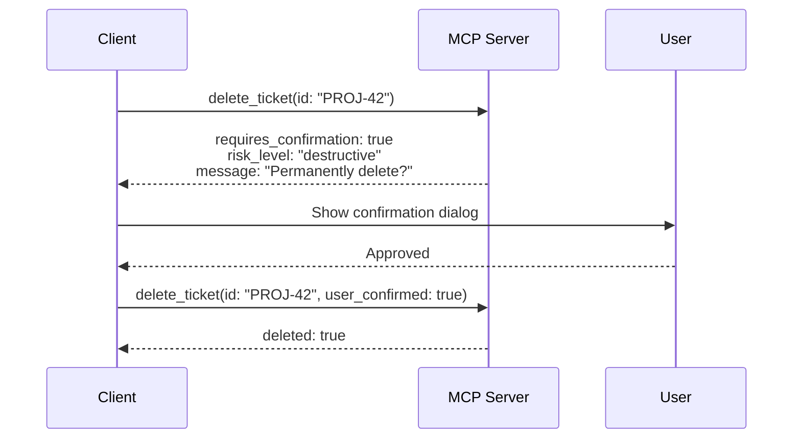
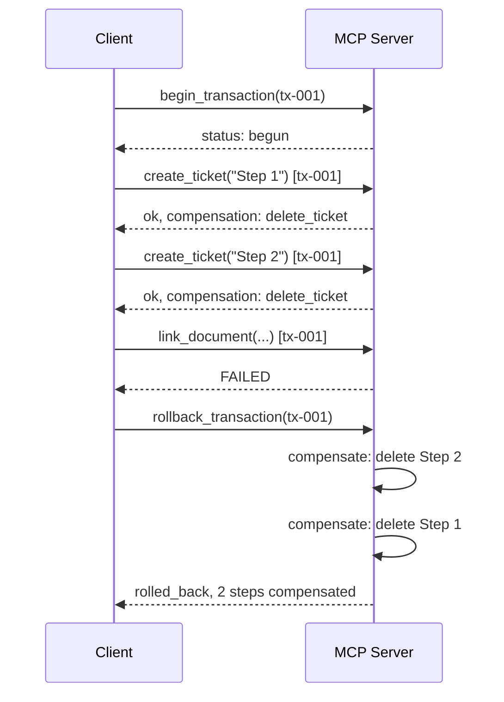
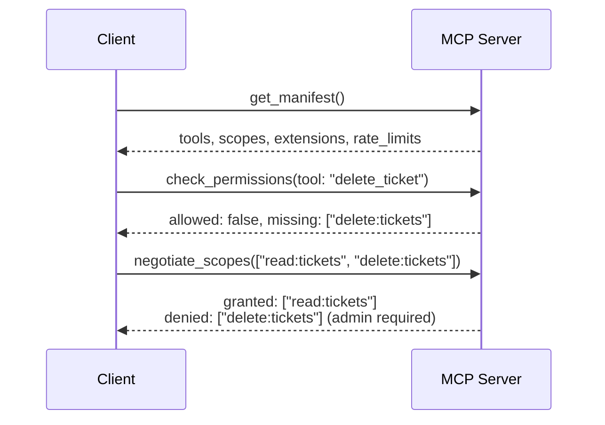

# Proposal: MCP Protocol Extensions for Robust Agent Workflows

[](https://github.com/davioe/mcp-extension-proposals/actions/workflows/validate.yml)

> **RFC-style gap analysis and extension proposals for the Model Context Protocol**

## Quick Start

This repository contains **15 concrete extension proposals** for the [Model Context Protocol (MCP)](https://modelcontextprotocol.io/), organized into 5 pillars. Each proposal includes a problem statement, solution design, JSON examples, limitations, and alternatives considered.

**What's inside:**
- **README** — Full proposal text with gap analysis against the current MCP spec
- **[`schemas/`](schemas/)** — JSON Schema 2020-12 definitions for all 15 proposals
- **[`examples/`](examples/)** — Reference implementations in Python and TypeScript, plus 5 example manifests
- **[`seps/`](seps/)** — SEP-formatted versions of the top 3 proposals, ready for submission to the official MCP repo

## Current Status

| Item | Status |
|------|--------|
| Spec baseline | [MCP 2025-11-25](https://modelcontextprotocol.io/specification/2025-11-25) |
| Schema dialect | JSON Schema 2020-12 (per SEP-1613) |
| Schema coverage | 15/15 proposals (10 dedicated files + 5 in service manifest) |
| Reference implementations | 15/15 proposals (Python + TypeScript) |
| Example manifests | 5 (GitHub, Jira, Slack, Linear, Notion) |
| SEP submissions | 3 prepared (#11, #5, #6) — not yet submitted |

## Table of Contents

- [What MCP Gets Right](#what-mcp-gets-right)
- [Relationship to Current MCP Spec](#relationship-to-current-mcp-spec-2025-11-25)
- **Pillar I — Transparency and Planning**
  - [1. Capability Discovery & Service Manifest](#1-capability-discovery-and-service-manifest)
  - [2. Intent Hints](#2-intent-hints)
  - [3. Cost & Latency Transparency](#3-cost-and-latency-transparency)
- **Pillar II — Safety and Reliability**
  - [4. Granular Permissions & Scoped Auth](#4-granular-permissions-and-scoped-auth)
  - [5. Idempotency & Transactions](#5-idempotency-and-transactions)
  - [6. Human-in-the-Loop](#6-human-in-the-loop-as-a-protocol-primitive)
  - [7. Provenance](#7-provenance--structured-source-attribution)
- **Pillar III — Performance and Scalability**
  - [8. Streaming & Progress](#8-streaming-and-progress-notifications)
  - [9. Data References](#9-data-references-instead-of-data-transfer)
  - [10. Multimodal Signatures](#10-multimodal-tool-signatures)
- **Pillar IV — Developer Experience**
  - [11. Structured Errors](#11-structured-error-model)
  - [12. Conformance Suite](#12-conformance-test-suite)
  - [13. Server Discovery](#13-server-discovery-and-recommendations)
- **Pillar V — Statefulness**
  - [14. Session State](#14-session-state-across-tool-calls)
  - [15. Bidirectional Push](#15-bidirectional-context-push)
- [Priority Summary](#priority-summary)
- [Design Principles](#design-principles)

## What MCP Gets Right

MCP is one of the most impactful ideas to emerge from the AI ecosystem in recent years. It solved a real problem — the lack of a standardized interface between language models and external tools — and solved it elegantly. The core design decisions are sound:

- **Open and model-agnostic.** Any model, any server, one protocol. This is the right foundation and must remain non-negotiable.
- **Simple request-response semantics.** Easy to implement, easy to reason about, easy to debug.
- **Tool-level granularity.** Servers expose discrete capabilities rather than monolithic APIs. This maps naturally to how agents plan and execute.
- **JSON-RPC transport.** A proven, lightweight wire format with broad ecosystem support.

For single-step tool calls — "search Jira for issue X", "fetch the weather in Berlin" — MCP already works remarkably well. This proposal is about what happens when you move beyond single steps.

> **Baseline:** This proposal is written against the [MCP specification revision 2025-11-25](https://modelcontextprotocol.io/specification/2025-11-25), which is the current released version as of March 2026. Tool annotations (`destructiveHint`, `idempotentHint`, `readOnlyHint`), `outputSchema`, elicitation, and Tasks (SEP-1686) are acknowledged where they overlap with these proposals.

## Where MCP Hits Its Limits

In practice, real-world agent workflows are multi-step, data-intensive, and failure-prone. MCP's current design creates systematic friction in five areas. This proposal addresses each with concrete, backwards-compatible extensions.

## Relationship to Current MCP Spec (2025-11-25)

The following table maps each proposal against the current specification and existing SEPs. This ensures we address **genuine remaining gaps**, not problems already solved.

| # | Proposal | Spec Coverage | Relevant SEP | Gap Status | What Remains | Details |
|---|----------|--------------|--------------|------------|-------------|---------|
| 1 | Capability Discovery & Manifest | `initialize` negotiation + tool `annotations` | SEP-2133 (Extensions), SEP-1865 (MCP Apps) | **Partially addressed** (major) | No operational metadata (rate limits, quotas, cost, latency per tool). No runtime re-introspection beyond `listChanged`. Extensions framework is GA but covers negotiation, not operational discovery. | [Audit](docs/spec-alignment/01-capability-discovery.md) |
| 2 | Intent Hints | None | — | **Gap** | No mechanism for clients to communicate *why* they are calling a tool. | [Audit](docs/spec-alignment/02-intent-hints.md) |
| 3 | Cost & Latency Transparency | None | — | **Gap** | No cost, latency, or quota metadata on tool definitions. | [Audit](docs/spec-alignment/03-cost-latency-transparency.md) |
| 4 | Granular Permissions & Scoped Auth | OAuth 2.1 at transport level | — | **Partially addressed** (major) | No per-tool scopes, no `can_execute` pre-flight check, no session TTL semantics. Permission boundaries discovered only through failures. | [Audit](docs/spec-alignment/04-scoped-auth.md) |
| 5 | Idempotency & Transactions | `idempotentHint` annotation (advisory only) | — | **Gap** | Hint tells clients a tool *is* idempotent — but provides no wire-level idempotency key mechanism or transaction/rollback protocol. | [Audit](docs/spec-alignment/05-idempotency-transactions.md) |
| 6 | Human-in-the-Loop | `destructiveHint` annotation (advisory) + Elicitation | — | **Partially addressed** (major) | Annotations are advisory — no mandatory confirmation protocol. Elicitation enables user input but is server-initiated for data gathering, not a tool-level "confirm before execute" gate. | [Audit](docs/spec-alignment/06-human-in-the-loop.md) |
| 7 | Provenance | None | — | **Gap** | No source attribution mechanism on tool responses. | [Audit](docs/spec-alignment/07-provenance.md) |
| 8 | Streaming & Progress | `notifications/progress` + SSE transport | SEP-1686 (Tasks, experimental) | **Partially addressed** (major) | Progress is numeric-only. No partial result streaming. No checkpoint/resume tokens. Tasks are experimental with incomplete SDK support. | [Audit](docs/spec-alignment/08-streaming-progress.md) |
| 9 | Data References | None | — | **Gap** | All data flows through the client. No server-to-server reference/transfer mechanism. | [Audit](docs/spec-alignment/09-data-references.md) |
| 10 | Multimodal Signatures | Base64 content types (image, audio) | — | **Partially addressed** (minor) | No tool-level MIME type declarations, no `max_input_size_bytes`, no efficient binary transport (multipart). All binary is base64-in-JSON. | [Audit](docs/spec-alignment/10-multimodal-signatures.md) |
| 11 | Structured Error Model | JSON-RPC error codes only | — | **Gap** | No `category`, `retry_after_seconds`, `user_actionable`, or `suggestion` fields. No structured retry semantics. | [Audit](docs/spec-alignment/11-structured-error-model.md) |
| 12 | Conformance Test Suite | None | Part of governance roadmap | **Gap** | No standardized test kit for validating servers against the spec. | [Audit](docs/spec-alignment/12-conformance-test-suite.md) |
| 13 | Server Discovery | None | — | **Partially addressed** (minor) | No registry, recommendation, or capability-based server search. | [Audit](docs/spec-alignment/13-server-discovery.md) |
| 14 | Session State | Transport-level `Mcp-Session-Id` | — | **Partially addressed** (major) | Session ID exists but no cross-call opaque state tokens (cookie-style). No TTL, no session resumption after disconnection. | [Audit](docs/spec-alignment/14-session-state.md) |
| 15 | Bidirectional Push | Resource-URI subscriptions only | — | **Partially addressed** (major) | Subscriptions limited to resource URIs. No general-purpose event subscription (e.g., "commit to main", "ticket resolved"). No event filtering or taxonomy. | [Audit](docs/spec-alignment/15-bidirectional-push.md) |

> **Note:** The Extensions framework (SEP-2133) is now GA in the 2025-11-25 spec, providing standardized capability negotiation for protocol extensions. MCP Apps (SEP-1865) introduces rich client-side UI rendering. Neither subsumes the proposals above — Extensions provides the *mechanism* for registering new capabilities but not the capabilities themselves, and MCP Apps addresses UI rendering rather than protocol-level safety or reliability gaps.

**Summary:** 0 proposals fully superseded, 7 partially addressed (5 major, 2 minor gaps), 8 not addressed. All 15 proposals identify genuine remaining gaps. See `docs/spec-alignment/` for detailed per-proposal audit.

---

## Pillar I — Transparency and Planning

### 1. Capability Discovery and Service Manifest

**Problem:** Clients today call tools semi-blindly. They learn what a server supports through static descriptions baked into prompts, and discover limitations only when calls fail.

**Proposal:** Every MCP server MUST expose a standardized service manifest at connection time — a machine-readable document containing:

- Available tools with fully typed input/output signatures
- Supported authentication mechanisms and current scopes
- Rate limits and quotas
- Support for streaming, pagination, and batch operations
- Server version and implemented MCP spec version

**Extension — Runtime Introspection:** Because server capabilities can change at runtime (new custom fields in Jira, new workspaces in Asana), servers SHOULD also expose a `/capabilities` endpoint that returns the current schema on demand — not only during the initial handshake.

This is similar in spirit to the Language Server Protocol's capability negotiation and would eliminate an entire class of trial-and-error tool calls.

> **Open question:** How frequently should manifests be refreshed? Runtime introspection addresses dynamic capabilities, but aggressive polling wastes resources while infrequent checks may serve stale metadata. A `manifest_ttl` or `listChanged`-style notification for manifest updates would help, but adds complexity.

---

### 2. Intent Hints

**Problem:** Tool calls communicate *what* the client wants to do (which tool, which parameters) but not *why*. The server has no way to suggest a better approach.

**Proposal:** An optional `intent` field on tool invocations that describes the purpose of the call:

```json
{
  "tool": "search_issues",
  "parameters": { "query": "deployment failure" },
  "intent": "Find the most recent ticket related to last Friday's deployment incident"
}
```

The server MAY respond with a routing suggestion:

```json
{
  "suggestion": {
    "recommended_tool": "get_recent_incidents",
    "reason": "Filters by incident type and recency, more efficient for this use case"
  }
}
```

This turns the server from a passive executor into a collaborative participant that can guide clients toward optimal tool usage.

> **Limitation:** Intent hints are inherently gameable. A malicious server could use the intent field to steer clients toward tools that maximize API consumption or data exfiltration. Clients SHOULD treat routing suggestions as advisory and apply their own trust model before following redirections.

---

### 3. Cost and Latency Transparency

**Problem:** Clients cannot estimate whether a tool call will take milliseconds or minutes, whether it incurs cost, or whether it consumes quota.

**Proposal:** The service manifest SHOULD declare per tool:

- Estimated latency class: `instant`, `seconds`, `minutes`
- Cost category: `free`, `metered`, `requires_approval`
- Quota consumption per call

```json
{
  "tool": "export_analytics",
  "cost": { "category": "metered", "estimated_units": 5 },
  "latency": "minutes",
  "quota": { "remaining": 12, "resets_at": "2026-03-16T00:00:00Z" }
}
```

This enables informed decision-making: "This export will take ~2 minutes and use 5 of your 12 remaining daily API calls. Should I proceed, or would you prefer a smaller date range?"

> **Limitation:** Cost and latency estimates are inherently approximate. Actual latency depends on server load, downstream API response times, and data volume — none of which are fully predictable at declaration time. Servers SHOULD treat these as categories (instant/seconds/minutes) rather than precise predictions, and clients SHOULD present them as estimates, not guarantees.

---

## Pillar II — Safety and Reliability

### 4. Granular Permissions and Scoped Auth

**Problem:** Permissions are binary — a server is connected or it isn't. Clients discover permission boundaries only through 403 errors.

**Proposal:**

- **Fine-grained scopes** declared during the MCP handshake, e.g., `read:github_repoX`, `write:linear_ticket`, `temp:30min`
- A **`/permissions` endpoint** or `can_execute` predicate that allows pre-flight permission checks before attempting a call
- **Session tokens with TTL** that automatically expire after a defined period of inactivity
- **Transparent scope reporting** so the client can inform the user: "I can read your Jira tickets but not edit them — would you like to grant write access?"

This is the prerequisite for users trusting agents with complex multi-step workflows. Without it, every chained operation is a gamble.

> **Limitation:** Scope granularity varies wildly across real APIs — GitHub has `repo`, `read:org`, `admin:repo_hook`; Jira has `read:jira-work`, `write:jira-work`; Slack has `channels:read`, `chat:write`. No universal scope taxonomy exists. This proposal defines the *mechanism* for scope negotiation, not a standard scope vocabulary. Server implementers must map their own API's permission model into the MCP scope format.

---

### 5. Idempotency and Transactions

**Problem:** Multi-step operations have no concept of atomicity. If step 3 of 5 fails, steps 1 and 2 remain in a potentially inconsistent state. Network failures can produce duplicates.

**Proposal:**

**Idempotency keys** as a standard header on state-changing operations. A repeated call with the same key MUST have no additional effect:

```
X-Idempotency-Key: op-2026-03-15-abc123
```

**Optional transaction wrapper** for multi-step operations. Servers that support transactions register compensation actions for each step:

```
BEGIN_TRANSACTION tx-001
  → create_jira_ticket(...)      → OK (compensate: delete_ticket)
  → link_confluence_doc(...)     → OK (compensate: unlink_doc)
  → post_slack_message(...)      → FAIL
ROLLBACK tx-001
  ← unlink_doc()
  ← delete_ticket()
```

The transaction mechanism is opt-in. Servers that don't support it simply reject `BEGIN_TRANSACTION` with a clear error. But for servers that do, this eliminates an entire category of silent data corruption.

> **Note:** The spec's `idempotentHint` annotation tells clients a tool *is* idempotent — but provides no mechanism to *enforce* it. An idempotency key is what makes "call this twice" actually safe at the wire level.

**Limitations and failure modes:**

- **Compensation failures.** The Saga pattern (compensation-based rollback) is best-effort, not ACID. If step 3 fails and the compensation for step 2 also fails (e.g., the Confluence API is down), the transaction enters a partially-rolled-back state. The protocol must surface this clearly — `steps_compensated` in the rollback response includes per-step status and error details — but it cannot guarantee full consistency across independent external systems.
- **No isolation.** Between `BEGIN_TRANSACTION` and `COMMIT`/`ROLLBACK`, other clients may observe intermediate state (e.g., a Jira ticket created in step 1 is visible before step 3 completes). This is inherent to compensation-based transactions over external APIs that don't support distributed locks.
- **CAP theorem applies.** Cross-system transactions (Jira + Confluence + Slack) operate across independent availability zones. Network partitions between the MCP server and any downstream API can leave transactions in an indeterminate state. The `timeout_seconds` field bounds the window, but the fundamental tension between consistency and availability remains.
- **Not a replacement for database transactions.** This model is appropriate for orchestrating API calls across loosely-coupled systems. For operations requiring true atomicity (financial transfers, inventory management), the backing system must provide its own transactional guarantees — the MCP transaction wrapper coordinates, but cannot upgrade the guarantees of the underlying APIs.

**Why this approach?** Two-phase commit (2PC) was rejected because it requires all participating systems to support a prepare/commit protocol — external SaaS APIs (Jira, Slack, Confluence) do not. Event sourcing was considered but adds complexity disproportionate to the use case — most multi-step agent workflows need "undo on failure," not a complete event log. Compensation-based Sagas are the standard pattern for distributed transactions across systems that only support forward operations and explicit rollback.

---

### 6. Human-in-the-Loop as a Protocol Primitive

**Problem:** There is no standardized mechanism for a server to signal "this action requires user confirmation before execution." Clients must guess which operations are dangerous.

**Proposal:** A `requires_confirmation` flag in tool definitions:

```json
{
  "tool": "delete_repository",
  "requires_confirmation": true,
  "confirmation_message": "This will permanently delete the repository and all its contents. Proceed?",
  "risk_level": "destructive"
}
```

When this flag is set, the client MUST obtain explicit user approval before executing the call. The `risk_level` field (`safe`, `reversible`, `destructive`) gives additional context for UI treatment.

> **Note:** The spec's `destructiveHint` annotation serves a similar purpose but is advisory — clients MAY ignore it. This proposal makes confirmation mandatory when `requires_confirmation` is set, creating a stronger safety guarantee. The two mechanisms can coexist: `destructiveHint` for backward-compatible hinting, `requires_confirmation` for enforced gates.

> **Limitation:** Mandatory confirmation adds latency to every destructive operation. In high-throughput agent workflows (e.g., bulk ticket updates), requiring user confirmation for each action may be impractical. A batch confirmation mode ("approve all 50 deletions at once") or a trust-level escalation mechanism would mitigate this, but adds protocol complexity.

---

### 7. Provenance — Structured Source Attribution

**Problem:** When a server returns data, there is often no machine-readable indication of where that data came from. This makes it difficult for clients to provide verifiable citations.

**Proposal:** Tool responses SHOULD include an optional `provenance` object:

```json
{
  "result": { "revenue_q3": 4200000 },
  "provenance": {
    "source": "invoice_v2.pdf",
    "location": { "page": 3, "paragraph": 2 },
    "retrieved_at": "2026-03-10T14:22:00Z",
    "confidence": "exact"
  }
}
```

This turns opaque data into traceable facts. The client can tell the user: "Q3 revenue was $4.2M — sourced from page 3 of invoice_v2.pdf, retrieved March 10th." That is a fundamentally different trust level than an unsourced number.

> **Limitation:** Provenance is only as trustworthy as the server providing it. A malicious or buggy server can return fabricated provenance metadata. Clients SHOULD treat provenance as a convenience for citation, not as cryptographic proof. True verifiability would require content hashing or signatures, which is outside the scope of this proposal.

---

## Pillar III — Performance and Scalability

### 8. Streaming and Progress Notifications

**Problem:** Long-running operations (database exports, PDF processing, batch jobs) block without feedback. The client cannot communicate progress to the user.

**Proposal:** A standardized progress notification channel:

```json
{
  "type": "progress",
  "operation_id": "op-42",
  "progress": 0.6,
  "message": "Processing row 6,000 of 10,000",
  "estimated_remaining_seconds": 12
}
```

For result-rich operations, additionally: **streaming partial results** so the client can begin presenting data before the operation completes, and **checkpoint tokens** that allow resuming an interrupted operation from where it left off rather than restarting.

> **Note:** SEP-1686 (Tasks) covers deferred execution and state tracking for long-running operations — but is still marked experimental with incomplete SDK support. This proposal's checkpoint/resume mechanism complements Tasks by adding data-level resumability, not just operation-level state tracking.

> **Limitation:** Checkpoint tokens assume the server can reconstruct its processing state from a token — this requires server-side state management (cursor positions, intermediate results). Stateless servers or servers backed by external APIs that don't support pagination cursors cannot implement checkpoints. The protocol should define checkpoint support as optional per-operation.

---

### 9. Data References Instead of Data Transfer

**Problem:** When data needs to flow from system A to system B, the client currently must pull it into its own context and push it out again. For large datasets, this is inefficient or impossible.

**Proposal:** A reference mechanism where the client can pass an opaque data reference from one server to another:

```
Server A (Amplitude) → export_result_ref("analysis-789")
Client → Server B (Google Sheets): import_from_ref("analysis-789")
```

The data flows directly between servers (or via a mediated channel). The client orchestrates without carrying the payload. This is analogous to Unix pipes — the shell connects processes without buffering all data in memory.

**Implementation considerations:**

The reference format itself is straightforward — an opaque ID with metadata (origin server, MIME type, size, expiry). The transport layer is the hard part:

- **Signed URLs with TTL** are the simplest approach. Server A generates a pre-signed URL (e.g., S3, GCS) with a time-limited token. Server B downloads directly. This works when both servers can reach the same storage backend, but requires shared cloud infrastructure and careful secret management.
- **Shared object store** (S3-compatible) assumes both servers have credentials to the same bucket. This is common within an organization but breaks across organizational boundaries.
- **Broker service** mediates the transfer without shared credentials. Server A uploads to the broker; Server B downloads from the broker using the reference ID. This is the most flexible but adds latency and a single point of failure.
- **Authentication delegation** is the unsolved problem. When Server B fetches from Server A's signed URL, it needs no credentials — the URL *is* the credential. But when using a broker, both servers need broker credentials, and the broker needs to verify that Server B is authorized to access a reference created by Server A. The authorization chain (User → Client → Server A → Broker → Server B) must be explicitly defined.

**Limitations:**

- **Size and timeout constraints.** Large datasets (>1GB) require chunked transfer and resumption. The `expires_at` field on references must account for transfer time, not just decision time. A reference that expires before the download completes is useless.
- **No standard exists for the transport layer.** This proposal defines the reference format and exchange protocol, but the actual data transport (signed URL vs. broker vs. shared store) is an implementation decision. Interoperability between different transport implementations is not guaranteed.
- **Cross-organization use requires trust negotiation** that is outside the scope of this proposal.

**Why this approach?** Streaming the full dataset through the client was rejected because it forces the client to buffer potentially gigabytes of data in its context window — a fundamental architectural mismatch. Shared-memory or IPC approaches were rejected because MCP servers are typically separate processes or remote services, not co-located modules. Opaque references are the minimal primitive that enables direct server-to-server transfer while keeping the client in control of orchestration.

---

### 10. Multimodal Tool Signatures

**Problem:** MCP is primarily text-oriented today. Images, audio, and other binary data are transported as Base64 strings in the text stream — inefficient and lossy for metadata.

**Proposal:** Standardized MIME type declarations in tool signatures:

```json
{
  "tool": "analyze_image",
  "input_types": ["image/png", "image/jpeg"],
  "output_types": ["application/json"],
  "max_input_size_bytes": 10485760,
  "binary_transport": "multipart"
}
```

The key constraint: this must remain **model-agnostic**. No vendor-specific image generation flags or proprietary format parameters in the core protocol. Vendor extensions belong in a separate namespace.

> **Limitation:** Defining a fixed set of supported MIME types in tool signatures creates a versioning problem — new media types (e.g., 3D models, point clouds) would require schema updates. The `input_types`/`output_types` arrays should be treated as declarative hints for capability matching, not as an exhaustive allowlist. Servers SHOULD accept content with unlisted MIME types when the underlying tool can handle them.

---

## Pillar IV — Developer Experience and Ecosystem

### 11. Structured Error Model

**Problem:** Error messages from MCP servers are often generic (`Error 500`). Clients cannot explain what went wrong or what the user can do about it.

**Proposal:** A standardized error schema:

```json
{
  "error": {
    "code": "RATE_LIMIT_EXCEEDED",
    "message": "API rate limit reached. Retry available in 42 seconds.",
    "category": "transient",
    "retry_after_seconds": 42,
    "user_actionable": true,
    "suggestion": "You could narrow the date range to reduce the query cost."
  }
}
```

The `category` field (`transient`, `permanent`, `auth_required`, `invalid_input`) enables intelligent retry logic. `user_actionable` tells the client whether to surface the error to the user or handle it silently. `suggestion` provides a concrete next step.

> **Limitation:** Error categories are necessarily coarse — real-world errors often span categories (e.g., a rate limit that is transient but also requires auth re-elevation). The `category` field should be treated as the primary classification for retry logic, with the `details` object carrying additional context. Servers SHOULD NOT use `suggestion` for security-sensitive guidance (e.g., "try a different API key") as this could be exploited in social engineering attacks.

---

### 12. Conformance Test Suite

**Problem:** There is no standardized way to test an MCP server against the spec. Server quality varies wildly, and clients must defensively handle every possible deviation.

**Proposal:** An official **MCP Conformance Test Kit** that validates:

- Correct service manifest structure and completeness
- Error schema compliance
- Idempotency behavior on repeated calls
- Scope declaration and permission check accuracy
- Streaming protocol conformance
- Graceful degradation for optional features

Servers that pass the suite can display a conformance badge. This creates a quality floor that benefits the entire ecosystem — better servers mean fewer defensive workarounds in every client.

> **Limitation:** Conformance testing can only validate observable protocol behavior, not internal implementation quality. A server may pass all conformance tests while still being unreliable under load, insecure in its data handling, or buggy in edge cases. The test suite should be positioned as a necessary condition for quality, not a sufficient one. Additionally, maintaining a conformance suite against a moving spec requires ongoing investment — tests must be versioned alongside the specification.

---

### 13. Server Discovery and Recommendations

**Problem:** When a client needs a capability that no connected server provides, there is no protocol-level mechanism to find a matching server.

**Proposal:** An optional `recommend_servers` endpoint:

```json
{
  "capability_needed": "design_mockup",
  "recommendations": [
    {
      "server": "figma-mcp-server",
      "registry_url": "https://mcp-registry.example.com/servers/figma",
      "auth_flow": "oauth2_device",
      "match_confidence": "high"
    }
  ]
}
```

Combined with a **central MCP server registry** where servers are searchable by capability, this creates a self-healing ecosystem. Instead of manual server hunting, the protocol itself routes clients toward the right tool.

> **Limitation:** A centralized registry creates a trust and governance problem: who decides which servers are listed? How are malicious or low-quality servers excluded? A decentralized approach (servers recommend peers they trust) avoids centralization but creates echo chambers. The registry model also raises privacy concerns — querying a registry reveals what capabilities a user needs, which may be sensitive in enterprise contexts.

---

## Pillar V — Statefulness

### 14. Session State Across Tool Calls

**Problem:** Every MCP tool call is stateless. When a client performs multiple sequential operations on the same context (open file, edit, save), it must re-transmit the full context each time.

**Proposal:** An optional **session state token** that the server can return and the client passes back on subsequent calls:

```json
{
  "tool": "edit_document",
  "parameters": { "action": "insert_paragraph", "text": "..." },
  "session_state": "eyJmaWxlX2lkIjoiZG9jLTQyIiwiY3Vyc29yIjo0Mn0="
}
```

The server decides what the state contains. The client treats it as an opaque token. This is the same pattern as HTTP cookies — simple, proven, and backwards-compatible (servers that don't use state simply never return the field).

**Why this approach?** Server-side session stores (Redis, database-backed) were rejected because they require server infrastructure beyond the MCP protocol itself and create state management burden for server implementers. Client-side structured state (where the client understands and manages the state) was rejected because it violates encapsulation — the server's internal state should not be a client concern. Opaque tokens give servers full control over state encoding while keeping the protocol simple and the client implementation trivial.

> **Limitation:** Opaque tokens shift storage burden to the client, which must persist and replay tokens it doesn't understand. Token size is unbounded — a server could encode megabytes of state, degrading client performance. The protocol SHOULD recommend a maximum token size (e.g., 64KB) and define behavior when tokens exceed it. Additionally, token invalidation is implicit (the server simply rejects stale tokens), which provides no graceful recovery path for the client.

---

### 15. Bidirectional Context Push

**Problem:** MCP is purely request-response today. Servers cannot proactively push relevant information to the client.

**Proposal:** An optional subscribe/notify mechanism:

```json
{
  "subscribe": {
    "server": "git-server",
    "events": ["commit_to_main", "pr_review_requested"],
    "filter": { "repository": "frontend-app" }
  }
}
```

The server sends notifications when matching events occur — no polling required. This is particularly valuable for real-time collaboration scenarios: a Git server that notifies when the branch was updated, a project management tool that alerts when a blocking ticket is resolved.

> **Note:** The current spec supports resource-URI subscriptions (`resources/subscribe`) and `listChanged` notifications, but these are limited to resource state changes. This proposal extends subscriptions to arbitrary domain events with filtering — a fundamentally different scope.

**Transport impact and limitations:**

- **stdio transport has weaker push guarantees.** The stdio transport uses stdin/stdout pipes. While servers can write to stdout at any time (and most clients maintain a read loop for JSON-RPC notifications), stdio lacks the connection management, backpressure, and reconnection semantics of WebSocket or SSE. High-frequency event streams over stdio may suffer from buffering issues, and there is no standard mechanism to signal subscription health or detect dropped events.
- **Streamable HTTP transport is the natural fit.** Server-Sent Events (SSE) over HTTP already support server→client push. This proposal's subscription mechanism maps cleanly onto SSE — each subscription becomes an SSE channel. The client opens a persistent connection, and the server pushes events as they occur.
- **Fallback for non-persistent transports.** For transports that don't support persistent connections, the subscription mechanism SHOULD degrade to a polling hint: the server returns `supported: false` for push subscriptions and instead includes a `poll_interval_seconds` recommendation. The client polls at the suggested interval using a standard tool call.
- **Subscription lifecycle management.** Long-lived subscriptions consume server resources (memory, connection slots, webhook registrations). The `ttl_seconds` field bounds the subscription lifetime, and the server MAY terminate subscriptions early under resource pressure. Clients must handle `subscription_terminated` notifications gracefully.
- **Event ordering is not guaranteed across subscriptions.** Events within a single subscription are delivered in order. Events across different subscriptions to the same server may arrive out of order due to internal server concurrency.

**Why this approach?** Polling was rejected because it wastes resources when events are infrequent and introduces latency proportional to the poll interval. Long-polling was considered as a middle ground but adds complexity for marginal benefit when SSE/WebSocket transports are already available. A subscription model with explicit event filtering is the standard pattern in event-driven systems (Webhooks, GraphQL Subscriptions, gRPC streaming) and maps naturally onto MCP's existing notification infrastructure.

---

## Priority Summary

| Priority | Proposal | Pillar |
|----------|----------|--------|
| **Critical** | Capability Discovery & Service Manifest | Transparency |
| **Critical** | Granular Permissions & Scoped Auth | Safety |
| **Critical** | Idempotency & Transactions | Safety |
| **Critical** | Streaming & Progress Notifications | Performance |
| **High** | Structured Error Model | DevEx |
| **High** | Human-in-the-Loop | Safety |
| **High** | Intent Hints | Transparency |
| **High** | Provenance | Safety |
| **Medium** | Cost & Latency Transparency | Transparency |
| **Medium** | Data References | Performance |
| **Medium** | Multimodal Signatures | Performance |
| **Medium** | Session State | Statefulness |
| **Medium** | Conformance Test Suite | DevEx |
| **Lower** | Server Discovery | Ecosystem |
| **Lower** | Bidirectional Push | Statefulness |

## Design Principles

All 15 proposals follow these constraints:

1. **Model-agnostic.** No vendor-specific extensions in the core protocol. Vendor-specific features belong in extension namespaces, never in the spec itself.
2. **Backwards-compatible.** Every extension is opt-in. Existing servers continue to work unchanged. Clients gracefully degrade when a server doesn't support a feature.
3. **Incrementally adoptable.** Each proposal is independent. They complement each other but can be implemented in any order.
4. **Proven patterns.** Nothing here is novel computer science. Idempotency keys, capability negotiation, session tokens, structured errors, progress streams — these are battle-tested patterns from HTTP, LSP, gRPC, and distributed systems. MCP just needs to standardize them.

## What This Proposal Deliberately Excludes

- **Vendor-specific primitives** such as model-bound image generation flags, proprietary auth token formats, or platform-specific preference headers. MCP's strength is universality; fragmenting the core protocol with vendor extensions would undermine its foundational value.
- **Overreach in scope.** MCP should remain a tool-integration protocol, not attempt to become a general-purpose agent framework. Orchestration logic, planning, and reasoning belong in the client, not the protocol.

## What's Included

This repository goes beyond the proposal text and includes concrete artifacts:

- **JSON Schemas** (JSON Schema 2020-12) for all 15 proposals — see [`schemas/`](schemas/)
- **Reference implementations** in Python and TypeScript for all 15 proposals — see [`examples/`](examples/)
- **5 realistic example manifests** for GitHub, Jira, Slack, Linear, and Notion — see [`examples/manifests/`](examples/manifests/)
- **3 SEP-formatted proposals** ready for submission to the official MCP repo — see [`seps/`](seps/)


For full coverage details, see the [coverage matrix](examples/README.md#coverage-matrix).

## Next Steps

### SEP Submissions (Planned)

Three proposals are being prepared for submission to the official MCP SEP process:

1. **#11 Structured Errors** (Standards Track) — see [`seps/0000-structured-error-model.md`](seps/0000-structured-error-model.md)
2. **#5 Idempotency & Transactions** (Extensions Track) — see [`seps/0000-idempotency-and-transactions.md`](seps/0000-idempotency-and-transactions.md)
3. **#6 Human-in-the-Loop** (Extensions Track) — see [`seps/0000-human-in-the-loop-confirmation.md`](seps/0000-human-in-the-loop-confirmation.md)

### Community Contributions Welcome

- **Security review** of the session state and transaction models
- **Co-implementation** — if you maintain an MCP server and would implement any of these extensions, please open an issue
- **Feedback and counter-proposals** — the goal is to improve the MCP ecosystem, not to be right about every design choice

## Flows

### Human-in-the-Loop Confirmation



### Transaction with Rollback



### Capability Discovery and Permission Flow


